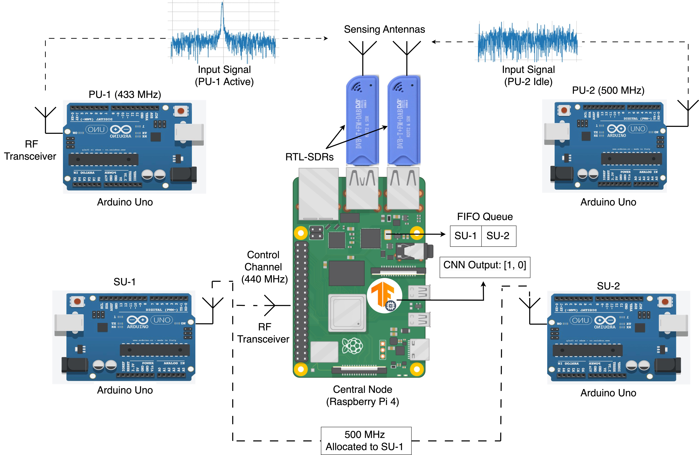

# Cognitive Radio Spectrum Sensing and Allocation: A Low-Complexity Deep Learning Approach

## About This Project

This research project served as our senior design project (SDP) for the Bachelor of Science in Computer Engineering program at the American University of Sharjah. It combines software and hardware implementations to address challenges in spectrum management through innovative and practical solutions. This repository serves as a showcase of our work and a resource for others interested in the field. 

**Submission Date**: 04/05/2024

**Team Members**:

- **Hamza Ahmed Abushahla**
- **Ghanim Abdulla Alarai Al-Ali**
- **Sultan Khalid Abdalla**
- **Muhammad Ismail Sadaqat**

**Advised by**:

- **Dr. Mohamed AlHajri**
- **Dr. Taha Landolsi**

---

## Abstract

In the field of wireless communication, the increasing demand for bandwidth has exposed the limitations of traditional radio frequency (RF) spectrum allocation methods. Static allocation techniques struggle to keep pace with modern requirements for dynamic and efficient solutions.

This project develops an intelligent spectrum management system using cognitive radio (CR) technology, featuring a low-complexity deep learning algorithm. The system identifies and reallocates underutilized spectrum bands to secondary users (SUs) while ensuring minimal disruption to primary users (PUs). It combines software simulations with hardware validation to provide practical, scalable solutions for next-generation wireless communication systems.

### Key Contributions

- **Low-Complexity Algorithm**: Employs deep learning for efficient spectrum sensing and allocation.
- **Dual Implementation**: Features both software simulations and hardware experiments.
- **Practical Application**: Demonstrates the integration of deep learning with modern hardware for real-world testing.
- **Scalable Design**: Facilitates future advancements in spectrum management and IoT applications.

---

## Hardware Implementation

The hardware implementation provides a practical demonstration of the project's proposed solutions. Below are the details of the components and setup:

### Components

1. **Central Node**:
   - Raspberry Pi 4 Model B (8GB RAM)
   - RTL-SDR USB dongle and antenna
2. **Primary User (PU) and Secondary User (SU) Nodes**:
   - Arduino Uno R3 microcontrollers
   - Adafruit RFM9x LoRa transceiver modules
3. **Sensors** (additional):
   - DHT-11 (temperature and humidity)
   - MQ-135 (gas detection)

### Hardware Setup

- The central node performs spectrum sensing and executes the deep learning algorithm using an RTL-SDR dongle.
- PU and SU nodes simulate wireless communication using LoRa transceivers.
- Sensors (DHT-11 and MQ-135) provide auxiliary data for experimental extensions.

#### Block Diagram

This block diagram illustrates the components and operational scenario of the system:

- The central node monitors specific frequency bands (433 MHz and 500 MHz, chosen for demonstration purposes) and handles SU requests via a dedicated 440 MHz channel.
- The RTL-SDR captures I/Q samples, and the CNN-based SS model processes them to identify spectrum availability.

**Operational Example**:
  1. SU-1 requests transmission, and the request is placed first in a FIFO queue.
  2. The CNN-based SS model analyzes data, outputting [1,0], indicating 433 MHz is occupied while 500 MHz is free.
  3. The central node allocates the free 500 MHz band to SU-1, effectively managing the spectrum resources.

**Experimental Setup**:

---

## Software Implementation

<!-- ### Tools Used

- **GNU Radio**: For signal processing and spectrum analysis.
- **Python**: For algorithm development and testing.
- **Arduino IDE**: For programming microcontrollers.

### Code Structure -->

The repository includes:

1. **Algorithm Code**:
   - Implementation of the deep learning model.
   - Spectrum sensing and allocation logic.
2. **Hardware Integration Code**:
   - Communication setup between nodes using LoRa.
   - Spectrum sensing and control logic.
3. **Experimental Scripts**:
   - Data collection and analysis scripts.

---

## Repository Contents

This repository provides all resources necessary to replicate or build upon the project:

- **/code**: Source code for both software and hardware components.
  - Implementation of the deep learning model.
  - Communication setup between nodes using LoRa.
- **/docs**: Supporting documents, including:
  - Final project report (PDF)
  - Project poster
  - Presentation slides
- **/hardware**: Block diagrams and detailed descriptions of the experimental setup.
- **/data**: Sample data and experimental results.
- **LICENSE**: Licensing information for the repository.

2. Navigate to the `docs` folder to review the project report and understand the implementation details.
3. Use the `code` folder to explore and execute the software and hardware integration.
4. Review the `hardware` folder for setup instructions and block diagrams.

---

## Acknowledgments

We express our gratitude to:

- The **American University of Sharjah** for providing the platform to execute this project.
- Our advisors **Dr. Mohamed AlHajri** and **Dr. Taha Landolsi** for their invaluable guidance and mentorship.

